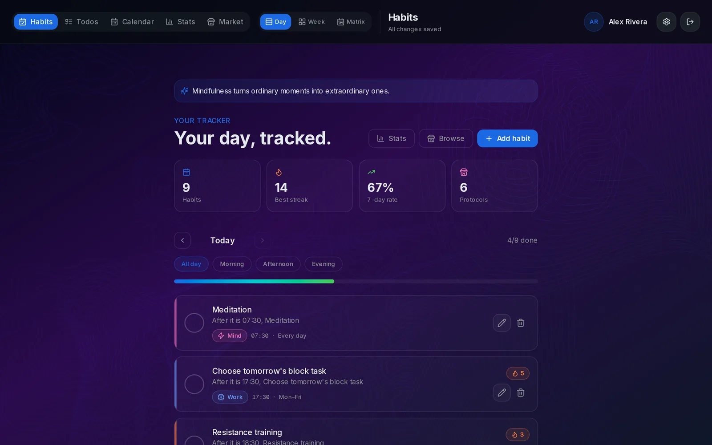
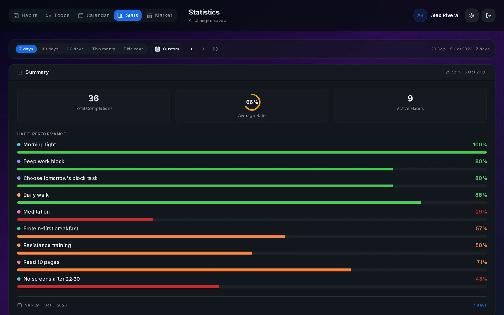
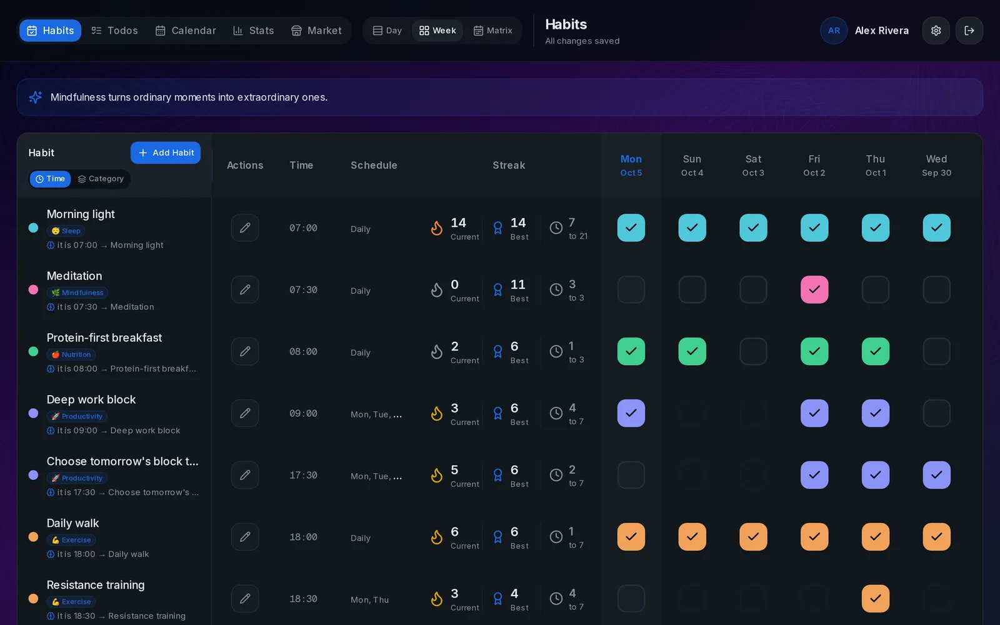
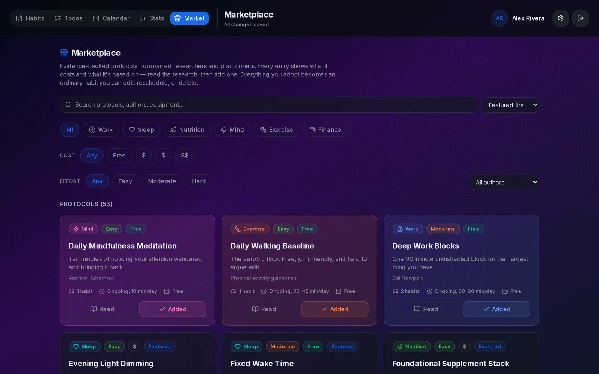
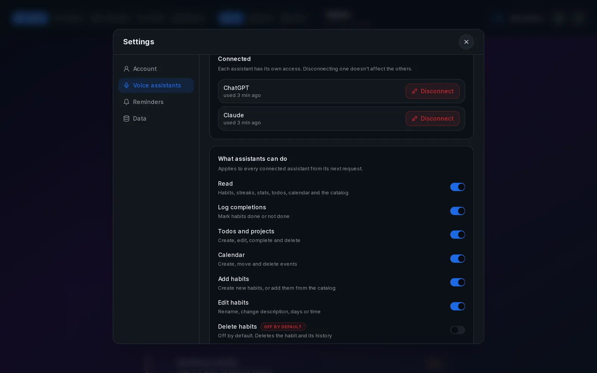
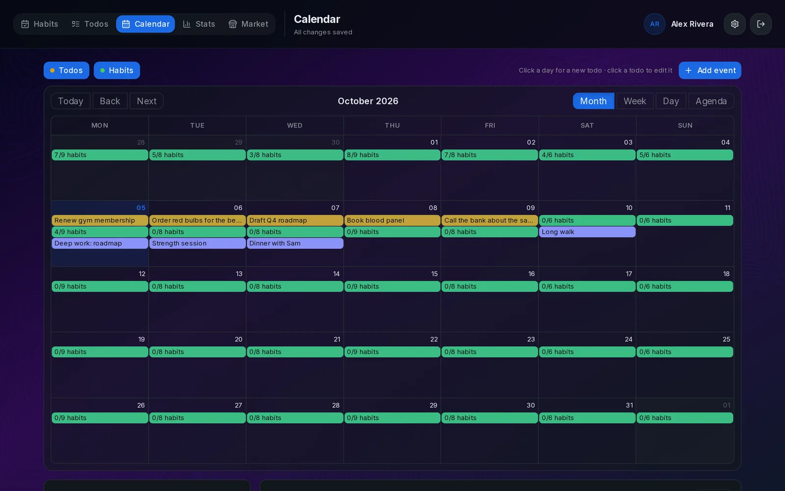
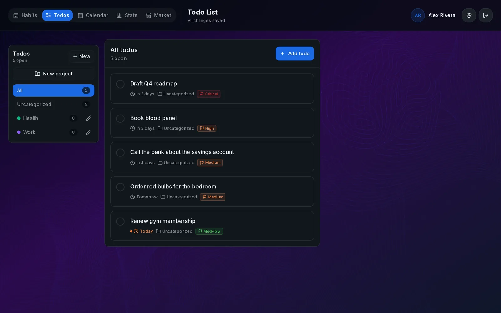
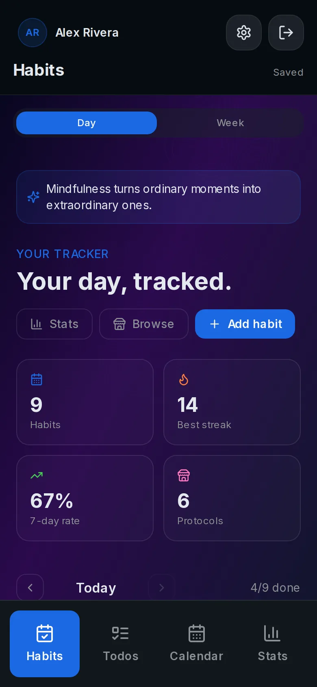
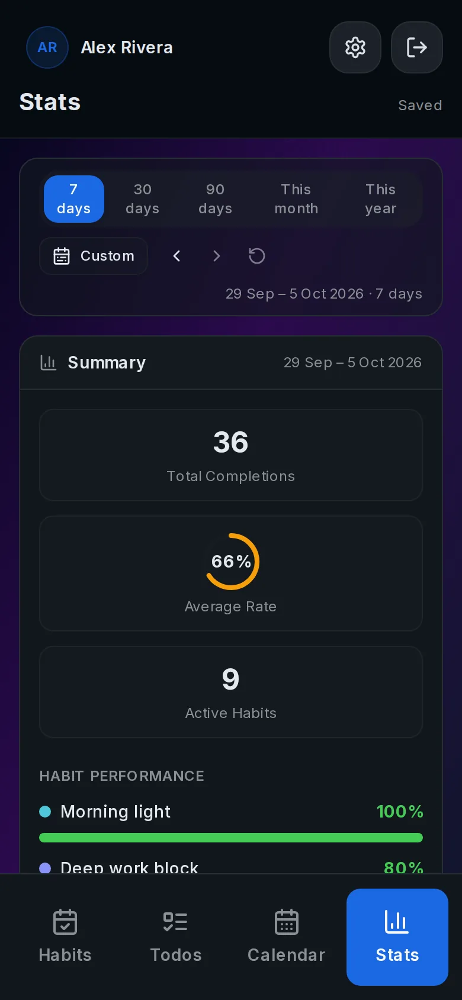
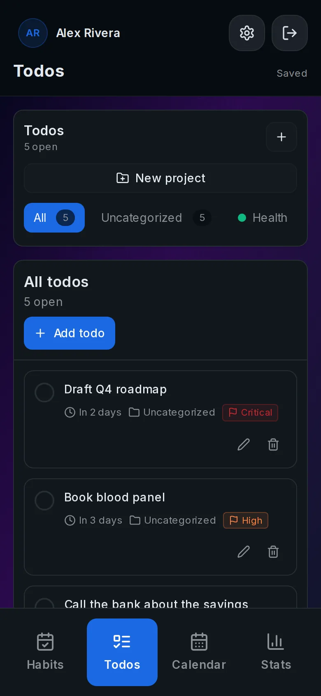

# Liberture

**A habit tracker you can talk to.** Track habits, streaks and evidence-based protocols, then log them from ChatGPT or Claude, by chat or by voice. Plus a directory of the people, books, organizations and research behind human optimization across six pillars: work, sleep, nutrition, mind, exercise and finance.

**[liberture.com](https://liberture.com)** · [Get started](https://liberture.com/get-started) · [Guides](https://liberture.com/guides) · [Protocols](https://liberture.com/protocols)



## What it does

- **Habit tracker:** daily, weekday or N-times-a-week habits with streaks, completion rates, a week grid, a year matrix, statistics, todos, projects and a calendar. Works on desktop and as an installable app on your phone.
- **Talk to it from ChatGPT or Claude:** an MCP server with OAuth lets your assistant read your habits, mark them done (including past days), add habits and todos, and answer "how did this week go?". Changes appear live in the open tracker.
- **Protocols:** 53 evidence-backed routines from researchers and practitioners. Each one turns into ordinary habits with one click, or when you ask your assistant.
- **Directory and content:** people, organizations, books, articles and the six pillars.
- **Your keys, your data:** sign-in is a Nostr key, with no email or password. Every assistant permission is switchable, and deleting habits is off by default.
- **English and Spanish** for the landing page, guides, sign-in and the whole tracker.

## Screenshots

| Statistics | Week view |
|---|---|
|  |  |
| **Protocol catalog** | **Connected assistants and permissions** |
|  |  |
| **Calendar** | **Todos** |
|  |  |

<p align="center">
  
  
  
</p>

## Connect ChatGPT or Claude

The connector URL is the same for everyone: `https://liberture.com/mcp`.

- **Claude:** Settings → Connectors → Add custom connector, paste the URL, press Connect and approve. [Guide](https://liberture.com/guides/connect-claude-to-your-habit-tracker)
- **ChatGPT:** Settings → Apps → Advanced, turn on developer mode, Create, paste the URL, choose OAuth and approve. [Guide](https://liberture.com/guides/track-habits-with-chatgpt)

Then ask "what's left today?". Technical reference: [/docs](https://liberture.com/docs) (MCP tools, scopes, the `/api/v1` REST API and the OpenAPI schema).

## Tech stack

- **Next.js 16** (App Router), React 19, Tailwind CSS 4, Radix UI, Framer Motion
- **PostgreSQL**, accessed through Prisma for the content and through the `postgres` client for the habit tracker
- **Nostr** sign-in (NIP-07 extensions, NIP-46 remote signers, nsec)
- **MCP and OAuth 2.1** (dynamic client registration, PKCE) for ChatGPT and Claude
- **Live updates:** Postgres `LISTEN/NOTIFY` pushed to the browser over Server-Sent Events

## Development

```bash
pnpm install
cp .env.example .env          # set DATABASE_URL (PostgreSQL)
pnpm exec prisma db push      # create/update tables
pnpm exec tsx scripts/seed-marketplace-protocols.ts   # protocol library
pnpm dev
```

| Variable | Purpose |
|---|---|
| `DATABASE_URL` | PostgreSQL connection string (shared by Prisma and the tracker) |
| `ADMIN_NOSTR_PUBKEYS` | Optional. Comma-separated hex pubkeys allowed into `/admin` |
| `ADMIN_SECRET` | Optional. Bearer secret for the tracker's admin endpoints |
| `HABIT_TRACKER_TIME_ZONE` | Optional. Default time zone for "today" in the assistant API |
| `RESEND_API_KEY` | Optional. Transactional email |
| `VAPID_PUBLIC_KEY`, `VAPID_PRIVATE_KEY`, `VAPID_SUBJECT` | Optional. Web Push for reminders and coach check-ins with the app closed (`node scripts/generate-vapid-keys.mjs`). See [docs/REMINDERS.md](docs/REMINDERS.md) |
| `REMINDER_SCHEDULER` | Optional. `off` disables the server reminder scheduler |

## Project layout

```
app/(site)/        public pages: landing, guides, docs, protocols, directory, pillars…
app/tracker/       the habit tracker
app/api/v1/        assistant REST API (also exposed as MCP tools at /mcp)
app/oauth/         OAuth authorize/token/register for ChatGPT and Claude
components/habits/ tracker, landing, docs and sign-in UI
lib/habits/        tracker logic: storage, streaks, protocols, MCP, OAuth, Nostr
lib/translations.ts  all UI copy, English and Spanish
prisma/            schema (content and habit tables)
```

## Deployment

Pushing to `master` deploys liberture.com through `.github/workflows/deploy.yml`. A Docker setup (`Dockerfile`, `compose.liberture-habits.yaml`) runs the same app with its own Postgres.

Reminders that arrive with the app closed need VAPID keys in the server environment; setup, behaviour and testing are in [docs/REMINDERS.md](docs/REMINDERS.md).

## License

Open source. See the repository for details.
